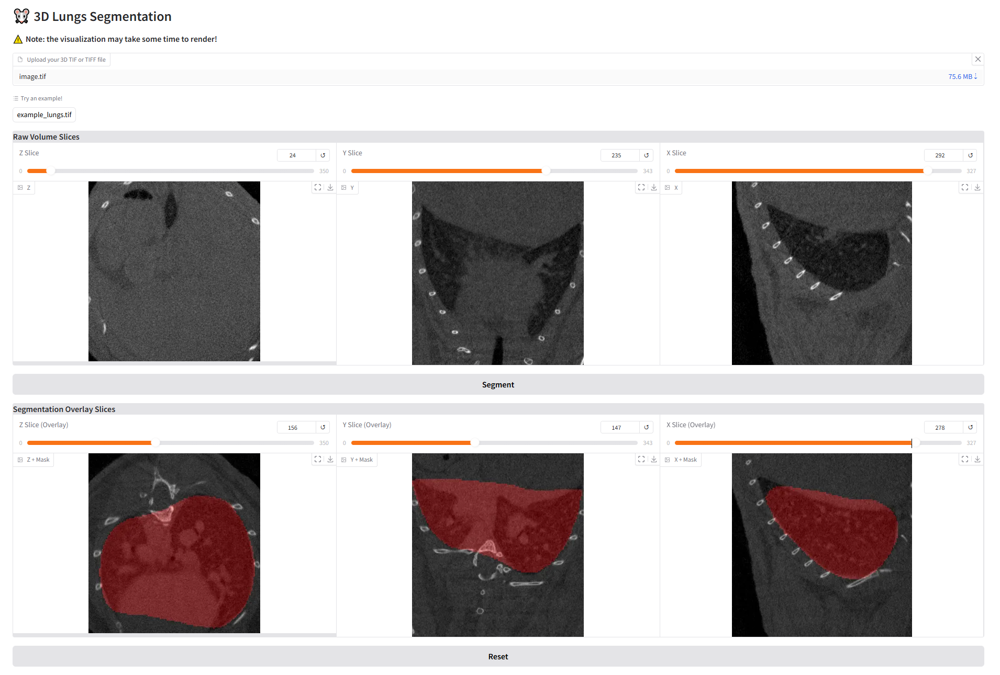

# 🖥️ Lungs segmentation web application
A web-based application for automated lung segmentation using deep learning, powered by **Gradio** and **PyTorch**. This tool allows users to upload lung images and obtain segmented outputs efficiently.

<p align="center">
    
</p>

## Installation
We recommend performing the installation in a clean Python environment.

The code requires `python>=3.10`, as well as `pytorch>=2.0`. Please install Pytorch first and separately following the instructions for your platform on [pytorch.org](https://pytorch.org/get-started/locally/).

After that please run the following command:
```sh
pip install -r requirements.txt
```

## Usage
Run:
```sh
python app.py
```
And go to http://localhost:7860/.

## About Lungs Segmentation
If you are interesten in the package used for segmentation please check the following [GitHub repository](https://github.com/titi1000/lungs-segmentation)!
